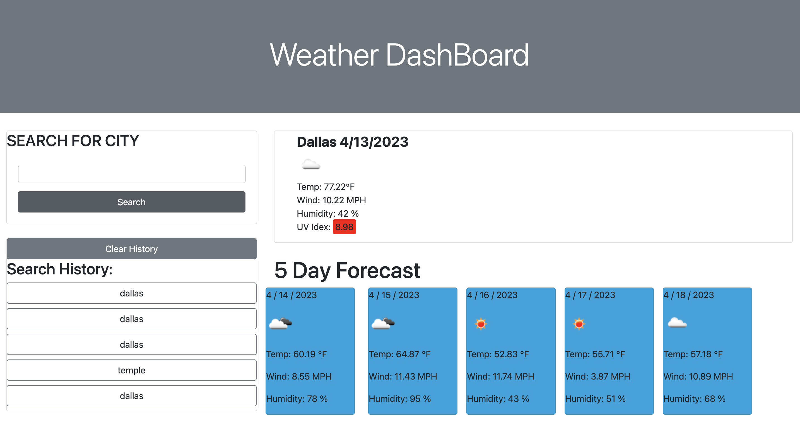

# Weather Dashboard 

### Table of Contents 
- [Description](#description)
- [How To Use] (#how-to-use)
- [Reference] (#reference)
- [License] (license)
- [Author] (#author-info)

---
## Description
In this project, I've created an Weather Dashboard using javasctipt. Once user searched weather for a city the app will save the recent to its history. Weather Dashboard will save to last 5 search to its history. 

## Technology
- [Open Weather API] 
- [Bootstrap]

## Link to Page 
[Link To My Final Page] (https://ja1993en.github.io/weather-dashboard/)

## References
- Open Weather API 
- Stack Over Flow 
- W3 School 
